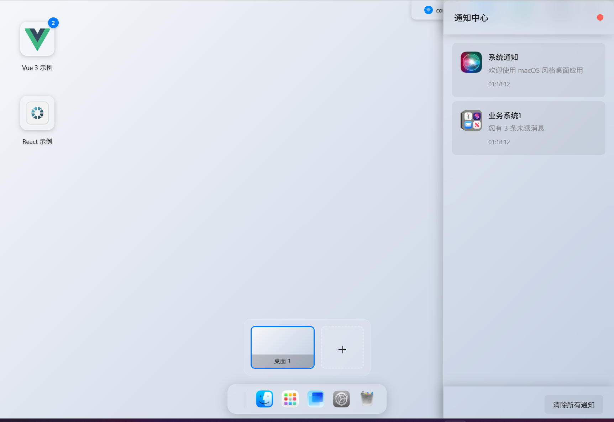
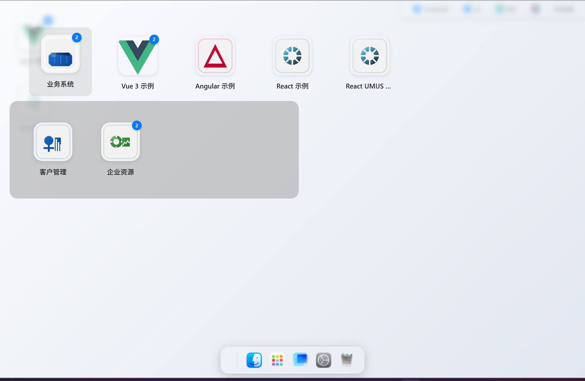
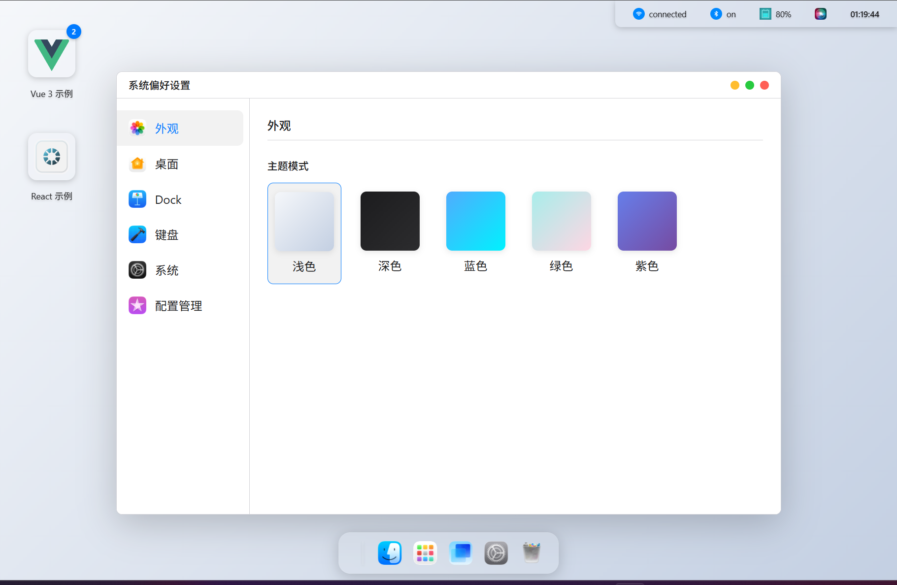
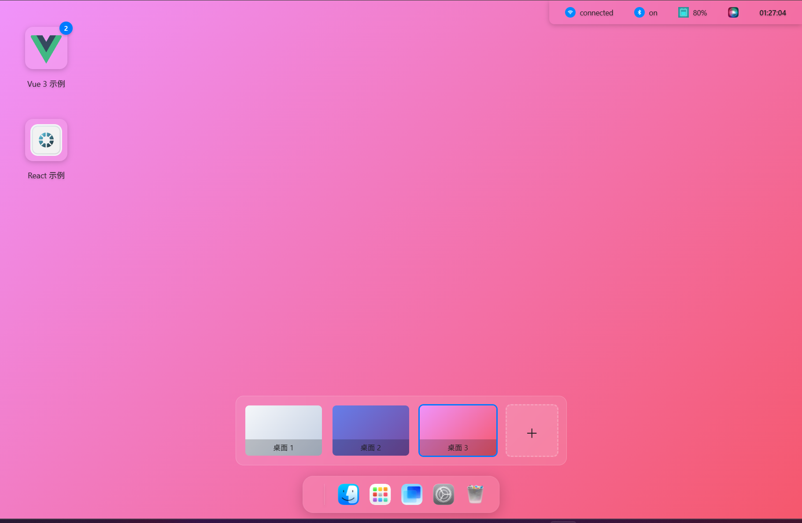
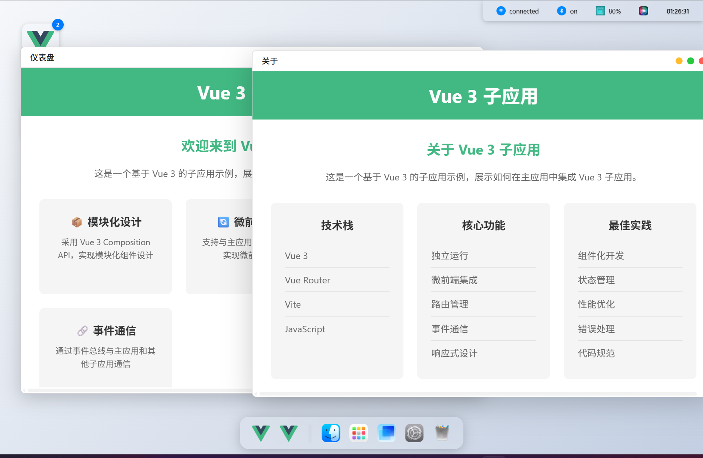

# macOS Style Desktop Environment

一个现代化的桌面环境模拟系统，基于 Vue 3 + Vite 构建，提供类 macOS 的用户体验，同时集成了强大的微前端架构，支持多框架子应用集成。

## 🎯 核心功能

### 桌面管理
- ✅ 桌面图标网格布局
- ✅ 图标长按拖拽排序
- ✅ 桌面背景切换（多种渐变背景）
- ✅ 桌面右键菜单
- ✅ 文件夹展开（毛玻璃效果）

### 窗口系统
- ✅ 窗口创建与管理
- ✅ 窗口拖拽移动
- ✅ 窗口最小化/最大化/关闭
- ✅ 多桌面窗口隔离

### 系统功能
- ✅ 系统菜单
- ✅ 通知中心
- ✅ 系统托盘
- ✅ 多桌面支持
- ✅ 桌面切换器
- ✅ 文件系统

### 应用管理
- ✅ 应用启动
- ✅ 应用右键菜单
- ✅ 文件夹层级展开
- ✅ 应用使用频率记录

### 微前端集成
- ✅ 基于 micro-app 框架的微前端架构
- ✅ 支持 Vue 3、React、Angular 等多框架集成
- ✅ 多级菜单系统，支持直接访问子应用业务功能
- ✅ 样式隔离（严格沙箱模式）
- ✅ 动态路由参数传递
- ✅ 子应用生命周期管理
- ✅ 子应用预加载和懒加载

### 视觉效果
- ✅ 毛玻璃效果（backdrop-filter）
- ✅ 平滑动画过渡
- ✅ 响应式布局
- ✅ 主题配置系统

## 🛠️ 技术栈

- **前端框架**: Vue 3 + Composition API
- **构建工具**: Vite
- **状态管理**: Pinia
- **微前端框架**: micro-app
- **CSS**: 原生 CSS + CSS 变量
- **图标**: 自定义图标系统

## 📦 项目结构

```
src/
├── assets/           # 静态资源
│   └── icons/        # 图标资源
├── components/       # 组件
│   ├── DesktopIcon.vue      # 桌面图标组件
│   ├── Window.vue           # 窗口组件
│   ├── Dock.vue             # 任务栏组件
│   ├── SystemMenu.vue       # 系统菜单组件
│   ├── FileSystem.vue       # 文件系统组件
│   └── ...
├── micro-app/        # 微前端相关
│   ├── micro-app-config.js  # micro-app 配置
│   └── event-bus.js         # 事件总线
├── services/         # 服务
│   └── appManagerService.js # 应用管理服务
├── stores/           # 状态管理
│   ├── configStore.js       # 配置状态管理
│   ├── desktopStore.js      # 桌面状态管理
│   ├── windowStore.js       # 窗口状态管理
│   └── microAppStore.js     # 子应用状态管理
├── styles/           # 样式文件
│   └── main.css             # 主样式文件
├── utils/            # 工具函数
│   └── dragManager.js       # 拖拽管理工具
├── App.vue           # 应用入口
└── main.js           # 主应用入口
```
## 效果截图
- 桌面
 
- 所有应用
 
- 文件系统
  
- 系统设置
  
- 多桌面切换
  
- 应用窗口
  
## 🚀 快速开始

### 安装依赖

```bash
npm install
```

### 开发模式

```bash
npm run dev
```

### 构建生产版本

```bash
npm run build
```

### 预览生产构建

```bash
npm run preview
```

### 示例应用启动

项目包含以下示例应用，需要单独启动：

1. **Vue 3 示例应用**
   ```bash
   cd examples/vue3
   npm install
   npm run dev
   ```
   访问地址: http://localhost:8081

2. **React 示例应用**
   ```bash
   cd examples/react
   npm install
   npm run start
   ```
   访问地址: http://localhost:3001

3. **React UMIJS 示例应用**
   ```bash
   cd examples/react-umijs
   npm install
   npm run dev
   ```
   访问地址: http://localhost:8000

4. **Angular 示例应用**
   ```bash
   cd examples/angular
   npm install
   ng serve
   ```
   访问地址: http://localhost:4200

## 🎨 主题系统

项目支持自定义主题，通过 CSS 变量实现，可在 `configStore.js` 中配置。

## 📱 交互特性

### 桌面图标
- **左键点击**: 打开应用或文件夹
- **长按**: 进入编辑模式，可拖拽排序
- **右键点击**: 显示应用右键菜单

### 文件夹
- 点击文件夹图标会在桌面中央弹出毛玻璃效果的文件夹窗口
- 支持层级展开子文件夹
- 点击应用图标启动应用

### 窗口操作
- **拖拽标题栏**: 移动窗口
- **点击窗口**: 激活窗口
- **窗口控制按钮**: 最小化/最大化/关闭

### 多桌面
- 支持创建多个桌面
- 支持在不同桌面间切换
- 窗口在不同桌面间隔离

## 🔧 配置选项

### 桌面配置
- 图标网格大小
- 图标间距
- 图标大小
- 背景样式

### 系统配置
- 功能开关（通知中心、系统托盘、多桌面等）
- 主题颜色

### 微前端配置
- 子应用注册
- 预加载策略
- 沙箱配置
- 生命周期管理

## 📝 开发指南

### 新增应用
在 `appManagerService.js` 中配置应用信息，支持多级菜单结构。

### 新增组件
遵循 Vue 3 Composition API 规范，使用 `<script setup>`。

### 状态管理
使用 Pinia 进行状态管理，遵循模块化原则。

### 微前端集成
1. 在 `appManagerService.js` 中注册子应用配置
2. 子应用需要实现 micro-app 生命周期钩子
3. 子应用需要支持接收主应用传递的路由参数

## 🎯 核心特性

### 1. 现代化的拖拽系统
- 长按触发拖拽
- 平滑的视觉反馈
- 智能位置计算
- 位置指示线

### 2. 毛玻璃效果
- 文件夹窗口
- 系统菜单
- 通知中心

### 3. 响应式设计
- 适配不同屏幕尺寸
- 智能布局调整

### 4. 多桌面支持
- 独立的桌面环境
- 窗口隔离
- 快速切换

### 5. 微前端架构
- 基于 micro-app 框架的轻量级微前端方案
- 支持多框架集成，实现技术栈无关
- 多级菜单系统，支持直接访问子应用业务功能
- 样式隔离，避免子应用样式影响主应用
- 动态路由参数传递，实现主应用与子应用的无缝集成

### 6. 性能优化
- 子应用预加载和懒加载
- 应用使用频率记录和智能预加载
- 微应用缓存机制
- 平滑的动画过渡

## 📖 微前端集成指南

### 1. 子应用改造

#### Vue 3 子应用
1. 安装 micro-app 依赖
2. 在 `main.js` 中实现 micro-app 生命周期钩子
3. 配置路由支持动态 baseroute

#### React 子应用
1. 安装 micro-app 依赖
2. 在 `index.js` 中实现 micro-app 生命周期钩子
3. 配置 React Router 支持动态 basename

#### Angular 子应用
1. 安装 micro-app 依赖
2. 在 `main.ts` 中实现 micro-app 生命周期钩子
3. 配置路由支持动态 baseroute

### 2. 主应用集成

1. 在 `appManagerService.js` 中注册子应用配置
2. 配置子应用的多级菜单结构
3. 启动子应用时传递路由参数

### 3. 测试验证

1. 启动主应用和子应用
2. 从主应用菜单直接访问子应用业务功能
3. 验证样式隔离和路由参数传递

## 📄 许可证

MIT License

## 👥 贡献

欢迎提交 Issue 和 Pull Request！

---

**享受现代化的桌面体验和微前端架构！** 🎉